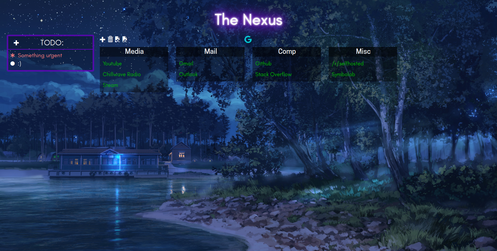

# Nexus Startpage
Forked from [this guy](https://github.com/EduardoZepeda/nexusStartPage).
You can see the original working in this [link](https://eduardozepeda.github.io/nexusStartPage/) and this version [here](http://internetseriousbusiness.tk/nexuspage/).

## Changes
I've made a lot of changes from the main repository to make the page look nicer, mainly on the CSS stuff.

I've also added a TODO list.

This page works better with Full HD resolution.

## Next Steps
* [ ] Editor menu
* [ ] Move categories
* [ ] Add Google menu at top-right of the page
* [ ] Replace Google search bar with something more interesting
* [ ] Add pages to control hosted services
* [ ] Fix TODO List bootstrap